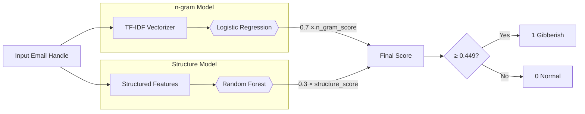
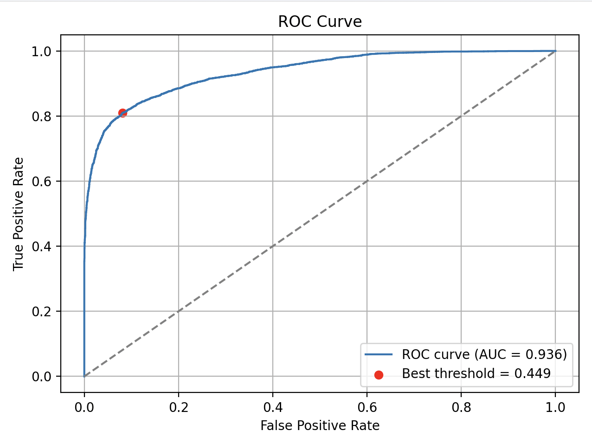
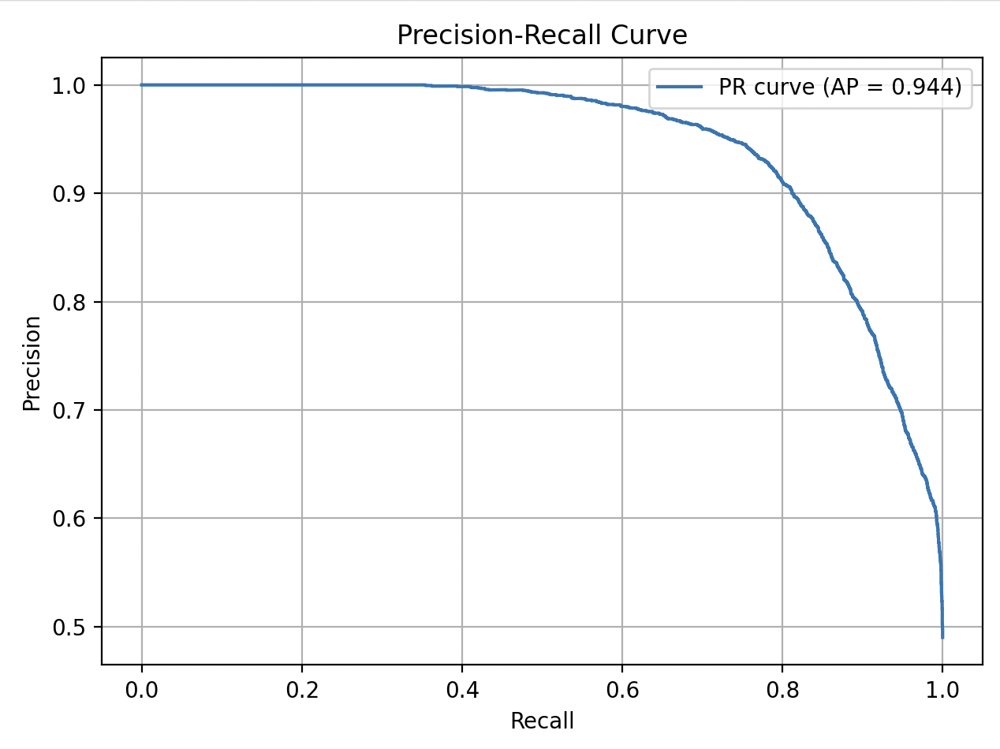
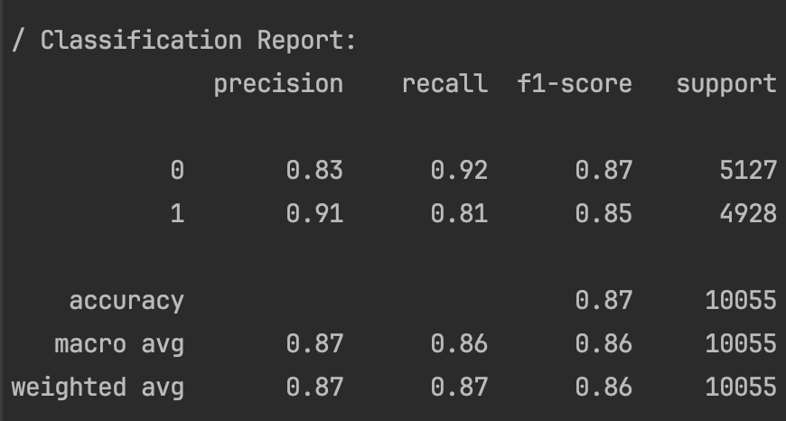
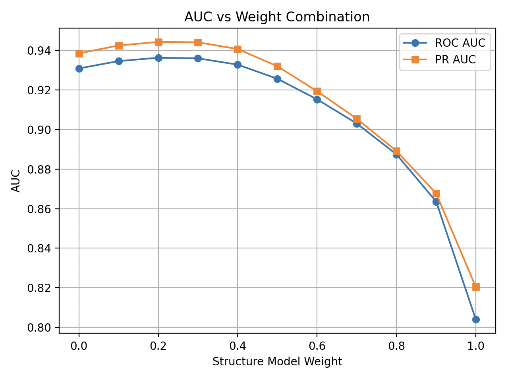

# Gibberish Detector 
**A tool to detect gibberish email handles using structural and pattern-based analysis.**


## Installation
**This script will auto-install required packages.**

## Configuration
### 1.Edit `config.yaml` to choose one input source:
- **Excel as input**
  ```yaml
  input_type: excel

  excel:
  filepath: data/sample.xlsx
  ```
  
- **SQL as input**
  ```yaml
  input_type: sql

  sql:
    query: |
      SELECT * FROM your_table 
  ```
  
### 2. Set the email_col name :
- **case-sensitive**
  ```yaml
  common:
    email_col: B2EM
  ```

## Usage
- **Once your configuration is ready, run the script from the project root:**
  ```bash
  $ python run_gibberish_detector.py
  ```
- **Results will be saved to the result/ folder, with a timestamped filename like:```(example: 20250610_1200_result.xlsx)```
```(Formate: YYYYMMDD_HHMM_result.xlsx)```**


## Design Overview
**This document summarizes the design and logic of the gibberish detector tool, including its n-gram-based and structure-based components.**



--- ✦ ✦ ✦ --- --- ✦ ✦ ✦ --- --- ✦ ✦ ✦ --- --- ✦ ✦ ✦ --- --- ✦ ✦ ✦ --- --- ✦ ✦ ✦ --- --- ✦ ✦ ✦ --- --- ✦ ✦ ✦ --- --- ✦ ✦ ✦ --- --- ✦ ✦ ✦ --- --- ✦ ✦ ✦ --- --- ✦ ✦ ✦ --- --- ✦ ✦ ✦ --- --- ✦ ✦ ✦ ---

## N-gram Model

### Feature Extractor: `TfidfVectorizer` (trained separately)
- Convert all characters to lowercase.
- Automatically extracts character-based **2-gram and 3-gram patterns**
- Keeps the **top 3000 most frequent n-grams**
- Example:
  - `"abc123"` → `"ab", "bc", "c1", "12", "23", "abc", "bc1", "c12", "123"`

### Predictive Model: `LogisticRegression`
- Learns statistical associations between n-gram patterns and gibberish likelihood
- Output: a gibberish **score between 0 and 1**

---

## Structure Model

### Feature Extractor: `extract_struct_features(handle)`
- Manually crafted features based on common gibberish patterns:
  - Length
  - Symbol rate
  - Consonant rate
  - digit_streak
  - uppercase_rate
  - alternation_rate (upper ↔ lower)
  - Transition rate (letters ↔ digits/symbols)
  - Name match (dictionary-based)

### Predictive Model: `RandomForestClassifier`
- Learns decision rules from the structured features
- Output: a gibberish **score between 0 and 1**

---

## Final Output: Weighted Score
The final gibberish score is calculated by combining the two models:
- **Final Score** = 0.3 × `structure_score` + 0.7 × `n_gram_score`

[//]: # (- **Final Threshold** = 0.449)

--- ✦ ✦ ✦ --- --- ✦ ✦ ✦ --- --- ✦ ✦ ✦ --- --- ✦ ✦ ✦ --- --- ✦ ✦ ✦ --- --- ✦ ✦ ✦ --- --- ✦ ✦ ✦ --- --- ✦ ✦ ✦ --- --- ✦ ✦ ✦ --- --- ✦ ✦ ✦ --- --- ✦ ✦ ✦ --- --- ✦ ✦ ✦ --- --- ✦ ✦ ✦ --- --- ✦ ✦ ✦ ---

##  Folder Structure
```
project_root/
├── ✦ README.md ✦                      # Project overview
├── ✦ data/ ✦                          # Input Excel files
├── ✦✦ gibberish_detector.ipynb ✦✦     # Main Script for running
├── gibberish_detector_helper.py   # Helper functions used across the project
├── models/                        # Trained machine learning model files (.pkl)
├── src/                           # Source code (feature extractors)
├── name_dicts/                    # Multilingual name dictionaries used for name matching
└── analysis_images/               # Saved charts, diagrams, and analysis visuals
``` 

--- ✦ ✦ ✦ --- --- ✦ ✦ ✦ --- --- ✦ ✦ ✦ --- --- ✦ ✦ ✦ --- --- ✦ ✦ ✦ --- --- ✦ ✦ ✦ --- --- ✦ ✦ ✦ --- --- ✦ ✦ ✦ --- --- ✦ ✦ ✦ --- --- ✦ ✦ ✦ --- --- ✦ ✦ ✦ --- --- ✦ ✦ ✦ --- --- ✦ ✦ ✦ --- --- ✦ ✦ ✦ ---

## Analysis images
  
 

--- ✦ ✦ ✦ --- --- ✦ ✦ ✦ --- --- ✦ ✦ ✦ --- --- ✦ ✦ ✦ --- --- ✦ ✦ ✦ --- --- ✦ ✦ ✦ --- --- ✦ ✦ ✦ --- --- ✦ ✦ ✦ --- --- ✦ ✦ ✦ --- --- ✦ ✦ ✦ --- --- ✦ ✦ ✦ --- --- ✦ ✦ ✦ --- --- ✦ ✦ ✦ --- --- ✦ ✦ ✦ ---

##  Structure Model – Feature Overview
 8 structural features used in gibberish detection model, along with updated examples to demonstrate the typical patterns each one detects.

##  Feature List

| **Feature Name** | **Type**  | **Range / Example**     | **Description**                                                                 |
|-----------------|-----------|--------------------------|---------------------------------------------------------------------------------|
| `length`        | Integer   | ≥ 1                      | Total number of characters in the email handle                                 |
| `symbol_rate` | Float     | 0.00 – 1.00              | Ratio of non-alphanumeric symbols to total length                              |
| `consonant_rate` | Float     | 0.00 – 1.00              | Ratio of consonants to total letters; set to 0 if letter count < 3             |
| `digit_streak`  | Integer   | ≥ 0                      | Longest uninterrupted digit sequence (excluding valid date formats)            |
| `uppercase_rate` | Float     | 0.00 – 1.00              | Percentage of capital letters among all letters                                |
| `alternation_rate` | Float     | 0.00 – 1.00              | Ratio of casing flips (upper ↔ lower) across letters                           |
| `transition_rate` | Float     | 0.00 – 1.00              | Ratio of letter-to-digit/symbol transitions to total length                    |
| `name_match`    | Binary    | 0 or 1                   | Whether the handle matches a known name from the dictionary                    |


### 1. `length`
- **Definition**: Total number of characters in the handle.
- **Example**:  
  Handle: `dsa450bsd5340sed32a40135hds4s`  
  → Total characters = **30**  
  → `length = 30`

---

### 2. `digit_streak`
- **Definition**: The longest uninterrupted sequence of digits (excluding date-like patterns).
- **Example**:  
  Handle: `applestore10091011+2`  
  → Longest digit chunk: `10091011` (8 digits)  
  → `max_digit_streak = 8`
- Date recognition supports formats:
  - `yyyymmdd`, `ddmmyyyy`, `mmddyyyy`, `yymmdd`

---

### 3. `consonant_rate`
- **Definition**: Percentage of consonants among all letters.  
- **Formula**: `consonant_count / total_letter_count`
- **Example**:  
  Handle: `zwyfqewjvnzoklq`  
  → Letters = 15, Consonants = 13  
  → `consonant_rate = 13 / 15 ≈ 0.867`

---

### 4. `uppercase_rate`
- **Definition**: Percentage of uppercase letters among all letters.  
- **Formula**: `uppercase_count / total_letter_count`
- **Example**:  
  Handle: `johnchen2go+EGJCK`  
  → Letters = 15, Uppercase = 5 (`EGJCK`)  
  → `uppercase_rate = 5 / 15 ≈ 0.334`

---

### 5. `alternation_rate`
- **Definition**: Frequency of switching between uppercase and lowercase letters.  
- **Formula**: `case_transitions / (total_letter_count - 1)`
- **Example**:  
  Handle: `ScIXqXsJOme`  
  → Many case flips: `S` → `c`,`c` → `I`, `X` → `q`, `q` → `X`, `X` → `s`, `s` → `J`, `O` → `m`  
  → `alternation_rate = 7/(11-1) = 0.7`

---

### 6. `transition_rate`
- **Definition**: How often the handle switches between letters and non-letters (digits or symbols).  
- **Formula**: `type_switch_count / (total_characters - 1)`
- **Example**:  
  Handle: `44dv8hh4g-fv5`  
  → Alternates between digits, letters, and symbol `-` : `4` → `d`, `v` → `8`, `8` → `h`, `h` → `4`, `4` → `g`, `g` → `-`, `-` → `f`, `v` → `5`  
  → `transition_rate = 8/(13-1) ≈ 0.667`
---

### 7. `symbol_rate`
- **Definition**: Proportion of special characters (`.`, `-`, `_`, `+`) in the handle.  
- **Formula**: `symbol_count / total_characters`
- **Example**:  
  Handle: `y.u.k.i.k.a.t.s.um.ata0930`  
  → 9 dots in 26 characters  
  → `symbol_rate = 6 / 27 ≈ 0.346`

---

### 8. `name_match`
- **Definition**: Whether the handle contains a match from our name dictionary.
- **Example**:  
  Handle: `yuki.katsumata.344`  
  → Matches: "yuki" (Japanese names)  
  → `name_match = 1`
- Dictionary filenames (Add file for other languages):
  - `chinese_names.txt`
  - `japanese_names.txt`
  - `vietnamese_names.txt`


